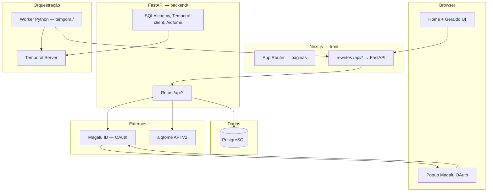
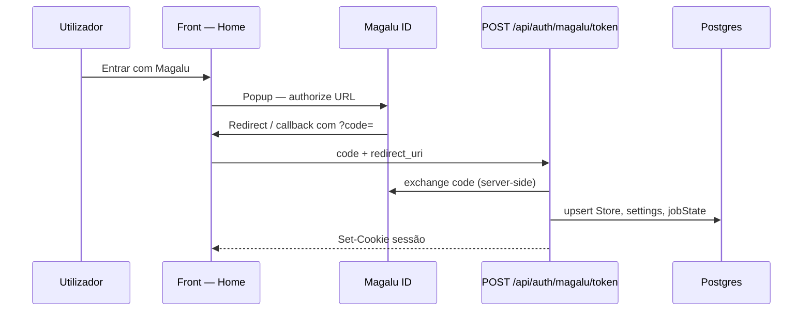
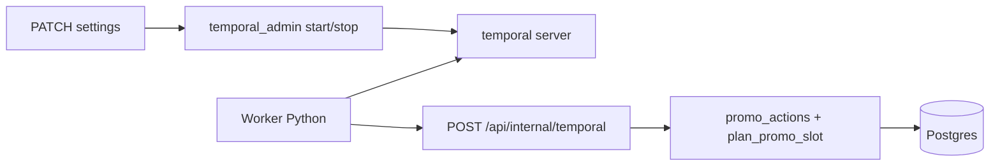

# Arquitetura — Liquida Fim de Turno

Documento de visão **end-to-end**: o que cada peça faz, como se conecta e onde vive o código. Complementa [`TEMPORAL.md`](TEMPORAL.md) (Temporal em profundidade), [`DATABASE.md`](DATABASE.md) (Postgres) e [`SPEC.md`](SPEC.md) (produto/API).

---

## 1. Objetivo do sistema

Aplicação **web** para lojistas **aiqfome** configurarem um **desconto automático** na janela **antes do último fechamento** do dia. O **FastAPI** (`backend/`) persiste configuração e estado em **Postgres**, autentica via **Magalu ID** (OAuth) e integra a **API V2 aiqfome**. O **Next.js** (`front/`) serve a UI e **encaminha** `/api/*` para o FastAPI. A **orquestração no tempo** é feita por **Temporal**: o **worker** (`temporal/`) chama **`POST /api/internal/temporal`** na URL pública do front (proxy → FastAPI).

---

## 2. Visão em camadas

**Ideia central:** o **FastAPI** concentra **regras de negócio**, **ORM**, **tokens Magalu**, **Aiqfome** e **API HTTP**. O **Next** é **UI + proxy**. O **worker** só **orquestra** no Temporal e chama a **API interna** com `TEMPORAL_INTERNAL_SECRET`.

---

## 3. Repositório — pastas importantes

| Caminho | Papel |
|---------|--------|
| [`front/src/app/`](../front/src/app/) | **App Router**: páginas, callback Magalu em `auth/magalu/callback/`. |
| [`front/src/components/`](../front/src/components/) | UI React (`home.tsx`, Geraldo UI). |
| [`front/src/lib/`](../front/src/lib/) | Utilitários de UI (`auth/post-message`, testes da janela em `jobs/promo-window.ts`). |
| [`front/prisma/schema.prisma`](../front/prisma/schema.prisma) | Schema alinhado ao Postgres (migrações / `db push` a partir de `front/`). |
| [`backend/app/`](../backend/app/) | FastAPI: routers, `promo_actions`, `plan_promo_slot`, Temporal admin, cliente Aiqfome. |
| [`temporal/`](../temporal/) | Worker Temporal: workflow + activities (HTTP ao BFF). |
| [`docs/`](README.md) | Produto, segurança, QA, Temporal, base de dados, **este ficheiro**. |
| [`infra/docker-compose.postgres.yml`](../infra/docker-compose.postgres.yml) | Sobe **só Postgres** localmente. |
| [`docker/front/Dockerfile`](../docker/front/Dockerfile) + [`railway.toml`](../railway.toml) | Imagem do **front**; healthcheck `GET /api/health` via proxy. |

---

## 4. Frontend e integração Geraldo

- A **UI principal** está em [`front/src/components/home.tsx`](../front/src/components/home.tsx): configuração e chamadas a `GET/PATCH /api/settings`, `GET /api/me` (servidas pelo FastAPI atrás do proxy).
- **Geraldo UI**: [`front/src/components/geraldo-register.tsx`](../front/src/components/geraldo-register.tsx) e [`front/src/app/layout.tsx`](../front/src/app/layout.tsx). [`front/next.config.mjs`](../front/next.config.mjs) define **CSP `frame-ancestors`** (`ALLOWED_FRAME_ANCESTORS`).
- **postMessage**: [`front/src/lib/auth/post-message.ts`](../front/src/lib/auth/post-message.ts) + `NEXT_PUBLIC_POSTMESSAGE_ORIGINS`.

---

## 5. Autenticação e sessão

- **Produção / iframe:** o `redirect_uri` costuma ser o **callback do Geraldo**; o **code** chega ao app via **`postMessage`** (`authCode`), e a home chama `/api/auth/magalu/token` (FastAPI em [`backend/app/routers/auth_magalu.py`](../backend/app/routers/auth_magalu.py), via proxy Next).
- **Teste local sem Geraldo:** redirect para [`/auth/magalu/callback`](../front/src/app/auth/magalu/callback/page.tsx) com **http** (não https em `localhost` sem TLS); mesma rota troca o code e define cookie; popup pode avisar a abertura com `magaluAuthDone`.
- **Dev sem OAuth real:** `SKIP_OAUTH_VALIDATION=true` + `POST` para token **sem** `code` cria/atualiza loja fictícia e sessão (lógica em `auth_magalu`).
- **Sessão:** cookie HTTP-only ligado a [`Session`](../front/prisma/schema.prisma); leitura/gravação em [`backend/app/deps.py`](../backend/app/deps.py). **Logout:** `POST /api/auth/logout`.
- **Tokens Magalu** no `Store`: `accessToken`, `accessExpiresAt`, `encryptedRefresh` ([`backend/app/crypto_secret.py`](../backend/app/crypto_secret.py)).

---

## 6. Dados (Postgres + Prisma)

- **Fonte de verdade** do schema: [`front/prisma/schema.prisma`](../front/prisma/schema.prisma).
- **`Store`**: loja (id interno + `externalStoreId`, timezone, tokens).
- **`StoreSettings`**: parâmetros da rotina (1:1 com loja).
- **`JobState`**: última execução, erros, `promoAppliedForDate`, `lastRevertDate` (atualizado pelas ações invocadas via API interna).
- **`Session`**: sessões web.
- **`PriceBaseline`**: snapshot JSON para reverter preços após promo.

Detalhe e **SQL útil**: [`DATABASE.md`](DATABASE.md).

---

## 7. Domínio: janela de promoção e efeitos

- [`front/src/lib/jobs/promo-window.ts`](../front/src/lib/jobs/promo-window.ts) — `computePromoAction`: função pura usada em **testes** para validar a janela lógica (agora, fuso, fechamento, lead, bitmask, estado).
- [`backend/app/plan_promo_slot.py`](../backend/app/plan_promo_slot.py) — usado em `POST /api/internal/temporal` (`planSlot`) para o **próximo slot** (início/fim ISO, `dateKey`, `skipApply`).
- [`backend/app/promo_actions.py`](../backend/app/promo_actions.py) — **efeitos** por loja: `reconcile_stale_promo`, `prepare_promo_apply_for_store` / `apply_promo_single_item_for_store` / `finalize_promo_apply_for_store` (apply em passos para o Temporal), `revert_promo_for_store`, chamados pela API interna.

Testes unitários da janela: [`promo-window.test.ts`](../front/src/lib/jobs/promo-window.test.ts).

---

## 8. Temporal + worker Python (único gatilho de automação)

1. **Servidor Temporal** guarda histórico do workflow e timers.
2. **FastAPI** [inicia/termina workflow](../backend/app/temporal_admin.py) quando a rotina é ligada/desligada em `PATCH /api/settings`, salvo kill switch `USE_TEMPORAL=false` (ex. ambiente sem Temporal).
3. **Worker** [`temporal/run_worker.py`](../temporal/run_worker.py) regista o workflow `storePromoLifecycleWorkflow` **por loja** (workflow id `liquida-promo-{storeId}`).
4. Cada activity do worker faz **HTTP** a `POST /api/internal/temporal` (URL pública do front; Next **proxy** → FastAPI) com `Authorization: Bearer <TEMPORAL_INTERNAL_SECRET>` e corpo `{ op, storeId, ... }`.

Detalhes: [`TEMPORAL.md`](TEMPORAL.md).

---

## 9. Integração aiqfome (API V2)

- Cliente no servidor: [`backend/app/aiqfome_client.py`](../backend/app/aiqfome_client.py) — dry-run e escrita conforme `AIQFOME_DRY_RUN`, `ENABLE_PROMO_WRITE`.
- **Base URL:** `AIQFOME_API_BASE_URL`.
- As **`promo-actions`** (invocadas pela API interna) obtêm o access token da loja (refresh Magalu: **TODO** explícito no código).

Contrato e evolução: [`SPEC.md`](SPEC.md).

---

## 10. Variáveis de ambiente (mapa mental)

| Área | Variáveis típicas |
|------|-------------------|
| DB | `DATABASE_URL` |
| Sessão / crypto | `TOKEN_ENCRYPTION_KEY` |
| Magalu | `MAGALU_*` (backend), `NEXT_PUBLIC_MAGALU_*` (front) |
| Dev | `SKIP_OAUTH_VALIDATION`, `NEXT_PUBLIC_DEV_LOGIN` |
| aiqfome | `AIQFOME_*`, `ENABLE_PROMO_WRITE` (backend) |
| Temporal | `USE_TEMPORAL`, `TEMPORAL_*`, `NEXT_APP_URL` (worker → URL do front) |
| Deploy / UI | `ALLOWED_FRAME_ANCESTORS`, `API_PROXY_URL` (front → FastAPI) |

Lista comentada: [`.env.example`](../.env.example).

---

## 11. Deploy e operações

- **Front:** `next build` em [`front/package.json`](../front/package.json); imagem [`docker/front/Dockerfile`](../docker/front/Dockerfile) (contexto raiz do monorepo). Detalhes: [`docs/DEPLOYMENT.md`](DEPLOYMENT.md).
- **Railway (ou similar):** Postgres + serviços **web** (front), **API** e **worker**; ver [`docs/DEPLOYMENT.md`](DEPLOYMENT.md).
- **Worker:** pasta [`temporal/`](../temporal/), com `NEXT_APP_URL` apontando ao front.
- **Temporal Server:** dedicado ou `temporal server start-dev` em dev.

---

## 12. Documentação relacionada

| Doc | Conteúdo |
|-----|-----------|
| [`ACCEPTANCE.md`](ACCEPTANCE.md) | Critérios de produto |
| [`SPEC.md`](SPEC.md) | API, OAuth, modelo de dados conceitual |
| [`UI_HANDOFF.md`](UI_HANDOFF.md) | Iframe, Geraldo, Magalu |
| [`SECURITY_CHECKLIST.md`](SECURITY_CHECKLIST.md) | Ameaças e checagens |
| [`QA_MATRIX.md`](QA_MATRIX.md) | Testes |
| [`TEMPORAL.md`](TEMPORAL.md) | Workflow, activities, API interna |
| [`DATABASE.md`](DATABASE.md) | Tabelas e SQL útil |
| [`README.md`](../README.md) | Setup local, scripts, deploy resumido |

---

## 13. Resumo em uma frase

**FastAPI** é o **cérebro** da API (auth Magalu, ORM, planeamento de slot, promo, Aiqfome, API interna); **Next** é **UI + proxy**; **Postgres** persiste tudo; **Temporal + worker** orquestram o tempo **por loja** e chamam o BFF em **`/api/internal/temporal`** (via URL do front).
