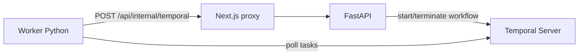

# Temporal neste projeto

Este documento descreve **como o Temporal está integrado** ao Liquida Fim de Turno: papéis de **workflow**, **activities**, **worker** e **API interna** (FastAPI em `backend/`, alcançável pelo browser/worker via Next com `API_PROXY_URL`), e como eles se encadeiam na rotina de promoção por loja.

## O que é Temporal (neste contexto)

**Temporal** é uma plataforma de orquestração de processos de longa duração. Ela guarda o **histórico** de execução do workflow (incluindo resultados de activities e timers) e, se o worker cair, **retoma** de onde parou sem repetir efeitos já concluídos.

Conceitos usados aqui:

| Conceito | Neste projeto |
|----------|----------------|
| **Workflow** | Código **determinístico** que define a sequência: reconciliar → planejar slot → dormir até início → aplicar → dormir até fim → reverter → repetir. |
| **Activity** | Trabalho com **efeitos colaterais** (HTTP, I/O, relógio “real”). Pode falhar e ser **reexecutada** com política de retry. |
| **Worker** | Processo que **escuta uma fila (task queue)**, executa workflows e activities registrados. |
| **Task queue** | Fila nomeada; o **cliente** agenda trabalho nela e o **worker** consome. Valor padrão: `liquida-promo`. |

Arquitetura resumida:

- O **FastAPI** (`backend/app/temporal_admin.py`) inicia ou encerra workflows quando a rotina da loja é ligada ou desligada (via `PATCH /api/settings`).
- O **worker Python** roda o workflow e as activities; as activities chamam `POST /api/internal/temporal` na URL pública do app (`NEXT_APP_URL`); o Next **repassa** a requisição ao FastAPI.

## Identificação do workflow

- **Nome do workflow (type):** `storePromoLifecycleWorkflow` (definido em `temporal/workflows.py`).
- **Workflow ID:** `liquida-promo-{storeId}` — uma execução “de longo prazo” **por loja**. Reiniciar a rotina faz **terminate** da execução anterior e **start** de uma nova com o mesmo padrão de ID (`startOrRestartPromoWorkflow`).

Timeouts de execução no cliente estão configurados para anos (`workflowExecutionTimeout` / `workflowRunTimeout`), porque o ciclo é um **loop infinito** enquanto a rotina existir.

## Worker Python

Arquivo: `temporal/run_worker.py`.

- Carrega `.env` e depois `.env.local` na raiz do repositório.
- Exige `TEMPORAL_INTERNAL_SECRET` (deve ser **idêntico** ao do FastAPI).
- Conecta em `TEMPORAL_ADDRESS` (padrão `localhost:7233`), namespace `TEMPORAL_NAMESPACE` (padrão `default`).
- Registra a fila `TEMPORAL_TASK_QUEUE` (padrão `liquida-promo`), o workflow `StorePromoLifecycleWorkflow` e as activities listadas abaixo.

Variáveis relevantes para o worker:

| Variável | Função |
|----------|--------|
| `TEMPORAL_ADDRESS` | Host:porta do servidor Temporal |
| `TEMPORAL_NAMESPACE` | Namespace Temporal |
| `TEMPORAL_TASK_QUEUE` | Deve bater com a fila usada no `workflow.start` do cliente Temporal no FastAPI |
| `TEMPORAL_INTERNAL_SECRET` | Bearer token para a API interna |
| `NEXT_APP_URL` | URL base do **front** **acessível pelo worker** (ex.: `http://host.docker.internal:3000`); o path `/api/...` é servido pelo FastAPI atrás do proxy Next |

## Workflow `StorePromoLifecycleWorkflow`

Entrada: `{ "storeId": "<id>" }`.

O corpo é um **`while True`** que implementa o ciclo de vida da janela de promoção:

1. **`reconcileStaleActivity`** — corrige estado inconsistente (promo “pendurada” de dia anterior) via API interna.
2. **`getPlannedSlotActivity`** — pergunta à API qual é o próximo **slot** (início/fim em ISO, `dateKey`, `skipApply`). Se `routineEnabled` estiver falso ou não houver slot, retorna `null`.
3. Se **não há slot**: `workflow.sleep(1 hora)` e volta ao passo 1.
4. **`msUntilActivity(promoStartIso)`** — calcula quantos milissegundos faltam até o início (ver seção “Por que `msUntil` é activity?”).
5. Se `ms_to_start > 0`: `workflow.sleep` esse intervalo.
6. **`preparePromoApplyActivity`** ou **`listPromoApplyItemUuidsActivity`** (conforme `skipApply`) devolvem uma lista de planos com `itemUuid`, `itemName` e `pricesSummary`. Em seguida, para cada item, **`applyPromoMenuItemActivity`** (um PUT aiqfome por activity; no histórico novo, o input inclui também nome e resumo de preços). Se **`skipApply`** for falso, **`finalizePromoApplyActivity`** marca `promoAppliedForDate`; se for verdadeiro, não roda `prepare` nem `finalize` (só reaplica PUTs a partir do baseline já salvo).
7. **`msUntilActivity(promoEndIso)`** + `workflow.sleep` até o fechamento.
8. **`revertPromoActivity`** — restaura preços / limpa estado de promo aplicada para aquele dia.
9. Volta ao passo 1.

Política comum para a maioria das activities:

- **`start_to_close_timeout`:** 5 minutos.
- **`RetryPolicy`:** até **5 tentativas**, intervalo inicial **10 segundos** (com backoff padrão do SDK).

Exceção: **`msUntilActivity`** usa timeout de **30 segundos** e **sem** `RetryPolicy` explícita no workflow (cálculo rápido e barato).

Timer de espera quando não há slot: **1 hora** (`_IDLE`).

## Activities — o que cada uma faz

Todas as activities estão em `temporal/activities.py`. Os **nomes registrados no Temporal** (para correspondência com histórico/depuração) são os do decorador `@activity.defn(name="...")`.

### `reconcileStaleActivity`

- **Nome Temporal:** `reconcileStaleActivity`
- **Argumentos:** `store_id: str`
- **Retorno:** `None`
- **Comportamento:** `POST` para `{NEXT_APP_URL}/api/internal/temporal` com corpo `{"op":"reconcileStale","storeId":...}` e header `Authorization: Bearer {TEMPORAL_INTERNAL_SECRET}`.
- **No FastAPI:** chama `reconcile_stale_promo` (`backend/app/promo_actions.py`): se a promo consta aplicada para um **dateKey anterior** ao dia atual no fuso da loja, restaura baseline na API (quando writes habilitados) e limpa `promoAppliedForDate` no `jobState`.

### `getPlannedSlotActivity`

- **Nome Temporal:** `getPlannedSlotActivity`
- **Argumentos:** `store_id: str`
- **Retorno:** `dict | None` — o JSON `slot` da resposta, ou `None` se a API devolver sem slot.
- **Comportamento:** mesmo endpoint, `{"op":"planSlot","storeId":...}`.
- **No FastAPI:** se `routineEnabled` for falso, responde `{ slot: null }`. Caso contrário calcula o próximo slot com `plan_next_promo_slot` (`backend/app/plan_promo_slot.py`):
  - **`dateKey`:** dia local `yyyy-MM-dd`.
  - **`promoEndIso`:** instante UTC do **último fechamento** daquele dia (API aiqfome working-hours; respeitando máscara de dias da semana).
  - **`promoStartIso`:** início da janela = fim − `leadMinutes` (ou “agora” em cenários de recuperação / já dentro da janela).
  - **`skipApply`:** `true` quando a promo **já está marcada** como aplicada para aquele `dateKey` e o relógio já está **dentro** da janela — o workflow **não** chama `prepare` nem `finalize`, mas ainda **reaplica** PUTs item a item via `listPromoApplyItemUuidsActivity` + `applyPromoMenuItemActivity` (útil após reinício do worker ou se os PUTs anteriores não chegaram na API). Se **`PriceBaseline`** estiver ausente ou não reversível (ex.: truncate), o `planSlot` devolve **`skipApply: false`** para forçar **`preparePromoApply`** antes dos PUTs.

### `msUntilActivity`

- **Nome Temporal:** `msUntilActivity`
- **Argumentos:** `iso: str` (timestamp ISO, com `Z` ou offset)
- **Retorno:** `int` — milissegundos até o instante alvo, **mínimo 0**.
- **Comportamento:** usa **relógio real** em UTC (`datetime.now(timezone.utc)`) e compara com o instante parseado de `iso`.
- **Importante para o workflow:** o resultado vira um evento no **histórico**. O `workflow.sleep` usa esse valor já “congelado” na replay — por isso não se usa `datetime.now()` **dentro** do código do workflow.

### `listPromoApplyItemUuidsActivity`

- **Nome Temporal:** `listPromoApplyItemUuidsActivity`
- **Argumentos:** `store_id: str`
- **Retorno:** `list[dict]` — cada elemento tem `itemUuid`, `itemName`, `pricesSummary`. Com **`PriceBaseline`** reversível, vem do snapshot. **Sem baseline** (ex.: após truncate), a API faz **preview** via GET list-items nas categorias salvas (`pricesSummary` = `—` até rodar `preparePromoApply`). Lista vazia se não houver categorias, OAuth ou se a API falhar.
- **Comportamento:** `{"op":"listPromoApplyItemUuids","storeId":...}` (resposta inclui `itemEntries` e `itemUuids`).
- **No FastAPI:** `list_promo_apply_item_entries_for_store` — não altera baseline; preview não substitui `prepare` para PUTs (apply ainda exige baseline).

### `preparePromoApplyActivity`

- **Nome Temporal:** `preparePromoApplyActivity`
- **Argumentos:** `store_id`, `date_key`
- **Retorno:** `list[dict]` — por item: `itemUuid`, `itemName`, `pricesSummary` (snapshot no baseline; ordem estável).
- **Comportamento:** `{"op":"preparePromoApply","storeId","dateKey"}`.
- **No FastAPI:** `prepare_promo_apply_for_store` — GET show-item por categoria, grava `PriceBaseline` (com nome e resumo de preços por item), **commit**; não faz PUT. Resposta inclui `itemUuids` e `itemEntries`. Se falhar, `ok: false` + `detail` e a activity lança erro.

### `applyPromoMenuItemActivity`

- **Nome Temporal:** `applyPromoMenuItemActivity`
- **Argumentos:** `store_id`, `item_uuid`, `date_key`, e opcionalmente `item_name`, `prices_summary` (só para exibição no Temporal Web UI; o POST interno continua só com os três primeiros campos).
- **Retorno:** `None`
- **Comportamento:** `{"op":"applyPromoMenuItem","storeId","itemUuid","dateKey"}` — **um** `PUT` na aiqfome por item. Retries e durabilidade ficam no Temporal, não num único POST longo.

### `finalizePromoApplyActivity`

- **Nome Temporal:** `finalizePromoApplyActivity`
- **Argumentos:** `store_id`, `date_key`
- **Retorno:** `None`
- **Comportamento:** `{"op":"finalizePromoApply",...}` — após todos os itens, atualiza `jobState.promoAppliedForDate` e limpa `lastError`.

### `revertPromoActivity`

- **Nome Temporal:** `revertPromoActivity`
- **Argumentos:** `store_id`, `date_key`
- **Retorno:** `None`
- **Comportamento:** `{"op":"revert",...}`.
- **No FastAPI:** `revert_promo_for_store` — restaura a partir do baseline, zera `promoAppliedForDate`, grava `lastRevertDate`.

### Detalhes de HTTP nas activities

- Operações que disparam efeito (`reconcile`, `preparePromoApply`, `applyPromoMenuItem`, `finalizePromoApply`, `revert`) e a leitura `listPromoApplyItemUuids` usam `httpx` com timeout **300 s** (`_post` / `_post_json`).
- `planSlot` usa timeout **60 s** e lê o corpo JSON.

Falhas HTTP (`raise_for_status`) fazem a activity **falhar**; o Temporal pode **repetir** a activity conforme a política configurada no `execute_activity`.

## API interna `POST /api/internal/temporal`

Implementação: `backend/app/routers/internal_temporal.py`.

- Exige `TEMPORAL_INTERNAL_SECRET` configurado no FastAPI.
- Autenticação: header **`Authorization: Bearer <segredo>`** exatamente igual ao valor da env.
- Corpo JSON com operações: `reconcileStale`, `planSlot`, `clearPriceBaseline` (apaga `PriceBaseline` e zera `promoAppliedForDate` para forçar novo `prepare`), `listPromoApplyItemUuids`, `preparePromoApply`, `applyPromoMenuItem`, `finalizePromoApply`, `revert`.

Qualquer erro não tratado vira resposta **500** com mensagem; o worker propaga falha na activity.

## Determinismo do workflow vs. activities

Código dentro de `@workflow.run` **não pode** depender de hora atual, aleatoriedade não reproduzível, ou I/O direto. Por isso:

- **Dormir até um instante** é feito assim: uma activity (`msUntilActivity`) calcula o atraso **uma vez** por passo; o workflow só chama `workflow.sleep(timedelta(milliseconds=...))` com esse número que já está no histórico.
- **Banco, ORM, chamadas externas** ficam nas activities e no handler FastAPI da rota interna.

Se no futuro alguém colocar `datetime.now()` ou `httpx` dentro do arquivo do workflow (fora de `unsafe.imports_passed_through`), a replay pode **quebrar** ou duplicar efeitos de forma incorreta.

O patch `workflow.patched("liquida-apply-item-display")` mantém **compatibilidade com históricos** que agendaram `applyPromoMenuItemActivity` só com três argumentos; execuções novas passam também `item_name` e `prices_summary` no input (visíveis no Temporal Web UI).

## Cliente Temporal no FastAPI

`backend/app/temporal_admin.py`:

- **`start_or_restart_promo_workflow(store_id)`** — se `USE_TEMPORAL` não for falso, termina o handle `liquida-promo-{storeId}` se existir e inicia novo run com argumento `{ storeId }`.
- **`stop_promo_workflow(store_id)`** — termina o workflow com motivo `routine_disabled`.

Quem chama isso costuma ser `PATCH /api/settings` ao ligar ou desligar a rotina.

## Como rodar em desenvolvimento (ordem)

1. Postgres e migrações/schema como no README.
2. Servidor Temporal (ex.: `temporal server start-dev` na porta **7233**).
3. FastAPI (`uvicorn app.main:app` em `backend/`) com `TEMPORAL_INTERNAL_SECRET` e demais envs.
4. Next (`npm run dev`) com `API_PROXY_URL` apontando ao FastAPI (ou padrão local).
5. Worker: `python temporal/run_worker.py` (com o mesmo segredo e `NEXT_APP_URL` alcançável).

Sem worker rodando, workflows ficam **aguardando** na fila até um worker se conectar.

## Resumo dos nomes Temporal ↔ Python

| Nome no Temporal (`activity.defn` / workflow) | Função Python / classe |
|-----------------------------------------------|-------------------------|
| `storePromoLifecycleWorkflow` | `StorePromoLifecycleWorkflow` |
| `reconcileStaleActivity` | `reconcile_stale_activity` |
| `getPlannedSlotActivity` | `get_planned_slot_activity` |
| `msUntilActivity` | `ms_until_activity` |
| `listPromoApplyItemUuidsActivity` | `list_promo_apply_item_uuids_activity` |
| `preparePromoApplyActivity` | `prepare_promo_apply_activity` |
| `applyPromoMenuItemActivity` | `apply_promo_menu_item_activity` |
| `finalizePromoApplyActivity` | `finalize_promo_apply_activity` |
| `revertPromoActivity` | `revert_promo_activity` |

Para aprofundar conceitos gerais do produto Temporal, a documentação oficial está em [https://docs.temporal.io](https://docs.temporal.io).
